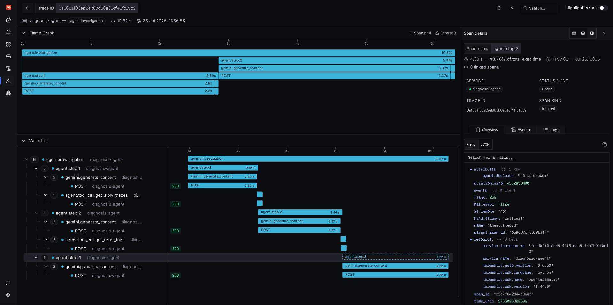

<div align="center">

# 🩺 AI SRE Agent

### It doesn't just detect incidents. It investigates them.

*An autonomous agent that reasons through live SigNoz telemetry — traces, logs, metrics — the way an on-call engineer would, and hands you a root cause instead of a wall of dashboards.*

[](https://signoz.io)
[](https://www.python.org/)
[](https://fastapi.tiangolo.com/)
[](https://opentelemetry.io/)
[](https://aistudio.google.com/)
[](#license)

📝 [Read the full write-up](https://dev.to/polikeybhuvan/i-built-an-ai-sre-agent-that-doesnt-just-detect-incidents-it-investigates-them-2l01) ·

</div>

---

## 🧭 The 30-second pitch

Every observability platform can tell you a service is slow or throwing errors. None of them tell you **why** — that step still lives in an engineer's head: open trace, check logs, form hypothesis, repeat.

**AI SRE Agent automates that first pass.** Given only three read-only tools (slow traces, error logs, error traces) and zero hardcoded logic, it decides for itself what to check first, what that result implies, and what to check next — then produces a plain-English diagnosis with a confidence-appropriate next step. The entire reasoning chain — every LLM call, every tool call, every decision — is instrumented with OpenTelemetry and shows up in SigNoz as its own trace, so the agent is exactly as observable as the system it's debugging.

| | Traditional monitoring | This agent |
|---|---|---|
| **Input** | Engineer reads dashboards manually | Agent queries SigNoz autonomously |
| **Investigation path** | Fixed runbook / hardcoded script | Decided dynamically, step by step |
| **Output** | Metrics and alerts | Plain-English root cause + next step |
| **Debuggability** | You debug the app | You debug the app *and* watch the agent think |

---

## 📊 Proof it works

From a real end-to-end run, captured live in SigNoz:

- **195** load-test requests → **158** succeeded, **37** failed (**81.03%** success rate) — realistic, noisy, production-shaped signal, not a scripted demo
- **3 reasoning steps, 2 tool calls, 1 diagnosis** — investigation completed in **10.6 seconds**
- The final synthesis step alone accounted for **40.78%** of total investigation time — visibility a chat transcript alone would never surface
- `frontend-service` and `order-service` independently converged on the **same 16.35% error rate** in the SigNoz dashboard — before the agent even got involved — while `diagnosis-agent` itself ran at 0% errors, a strong signal it was reasoning, not just serving fast requests

<div align="center">


<sub><b>The agent's own investigation, captured as a SigNoz trace.</b> 14 spans, 0 errors, 10.62s end to end. <code>agent.step.3</code> — the final synthesis where the model commits to <code>agent.decision: "final_answer"</code> — takes 4.33s alone, 40.78% of the whole investigation. That's the kind of per-step cost breakdown a plain chat transcript never gives you.</sub>
</div>

*(Add the SigNoz services dashboard and load-test summary screenshots the same way — upload `dashboard.png` and `load-test.png` to the repo root, same as `trace-waterfall.png`, and reference them with the same `` pattern above.)*

---

## 🏗️ Architecture

```
frontend-service (8001) → order-service (8002) → inventory-service (8003)
                                ↓
                         agent-service (8004)   [simulated LLM/AI call]
```

Four small FastAPI services, deliberately built to fail like real production systems fail:

| Service | Role | Injected chaos |
|---|---|---|
| **frontend-service** | Entry point (`/checkout`) | — |
| **order-service** | Calls inventory + a simulated AI agent step | Random delay, 500/502 errors, simulated deadlocks |
| **inventory-service** | Simulates a slow DB call | Occasional connection-pool exhaustion (503) |
| **agent-service** | Simulates an LLM call with fake token counts | Occasional malformed/"hallucinated" responses that `order-service` must catch and fall back on |

All four are auto-instrumented with OpenTelemetry and export traces, logs, and metrics to SigNoz over OTLP.

### The diagnosis agent

`agent_diagnose.py` drives the investigation using **Gemini's function-calling API** with exactly three tools — no more:

```
get_slow_traces()          # slowest root-level traces, across all services
get_error_logs(service)    # recent ERROR-level structured logs, optionally scoped
get_error_traces()         # traces containing at least one error span
```

The agent loops for up to 5 steps — **call a tool → inspect the result → decide whether to dig deeper or diagnose** — with no hardcoded branching. Change the failure injected into the services, and the investigation path changes with it.

### A real investigation, step by step

1. **Cast a wide net.** `get_slow_traces()` surfaces multiple ~6s requests, all pointing at `frontend-service` on `GET /checkout`. Slow ≠ guilty, so the agent keeps digging.
2. **Narrow in.** `get_error_logs(frontend-service)` reveals the frontend wasn't failing — it was waiting on `order-service`, which was returning HTTP 502.
3. **Diagnose.** The agent concludes the root cause likely lives in `order-service` or a downstream dependency, and — instead of overclaiming certainty — recommends the specific next check.

### Observing the observer

The agent's own reasoning is wrapped in OpenTelemetry spans and shows up in SigNoz as a `diagnosis-agent` trace:

```
agent.investigation
├── agent.step.1
│      ├── Gemini API call
│      └── get_slow_traces()
├── agent.step.2
│      ├── Gemini API call
│      └── get_error_logs()
└── agent.step.3
       └── Final diagnosis
```

Every span records prompt/completion/total tokens, response latency, and tool execution timing. **The same platform that debugs the application also debugs the AI deciding what's wrong with it** — that dual-purpose trace is the core idea of this project.

---

## 🚀 Getting started

### Prerequisites

- Docker
- Python 3.10+
- A self-hosted SigNoz instance ([install guide](https://signoz.io/docs/install/self-host/))
- A Gemini API key from [Google AI Studio](https://aistudio.google.com/)

### 1. Install dependencies

```bash
python -m venv venv
venv\Scripts\activate        # or `source venv/bin/activate` on Mac/Linux
pip install -r requirements.txt
pip install opentelemetry-distro opentelemetry-exporter-otlp
opentelemetry-bootstrap -a install
```

### 2. Start the microservices

Run each service in its own terminal, pointed at your SigNoz OTLP endpoint:

```bash
set OTEL_EXPORTER_OTLP_ENDPOINT=http://localhost:4317
set OTEL_SERVICE_NAME=frontend-service
opentelemetry-instrument python frontend_service.py
```

Repeat for `order_service.py`, `inventory_service.py`, and `agent_service.py`, swapping in the matching `OTEL_SERVICE_NAME` each time.

### 3. Generate traffic

```bash
python load_test.py
```

Continuously fires checkout requests — some succeed, some fail, some run slow — so there's real, noisy telemetry for the agent to work with.

### 4. Run the agent

Fill in `SIGNOZ_API_KEY` and `GEMINI_API_KEY` in `agent_diagnose.py`, then:

```bash
set OTEL_SERVICE_NAME=diagnosis-agent
opentelemetry-instrument python agent_diagnose.py
```

---

## 📁 Project structure

| File | Purpose |
|---|---|
| `frontend_service.py`, `order_service.py`, `inventory_service.py`, `agent_service.py` | The flaky microservices chain |
| `json_logger.py` | Shared structured JSON logging helper |
| `load_test.py` | Continuous traffic generator |
| `agent_diagnose.py` | The tool-calling AI diagnosis agent |
| `diagnose.py` | Earlier, simpler fixed-query version (kept for reference) |
| `monitor.py` | Continuous monitoring loop that triggers the agent when error rates spike |

---

## 💡 What I learned

Dashboards answer questions you already know to ask. Investigations begin the moment you don't know what to ask next — and that's exactly where an agent earns its keep: not replacing an SRE, but automating the repetitive first pass of an incident.

Most of the build time, honestly, went into infrastructure rather than agent logic: WSL and Docker networking, ClickHouse startup issues, migrating to SigNoz's new install, and getting OpenTelemetry wired correctly across four services. That friction is a fairly accurate preview of what building real observability tooling looks like.

## 🗺️ Roadmap

- [ ] Always-on monitoring loop that auto-triggers investigations when error rates spike
- [ ] More realistic, varied production failure scenarios
- [ ] Auto-generated incident reports after every investigation
- [ ] Swap handwritten API tools for SigNoz's **MCP server**
- [ ] Multi-agent collaboration — dedicated agents for logs, metrics, and traces that investigate independently, then reconcile findings

---

## 🤝 Contributing

Issues, ideas, and PRs are welcome — this started as a solo hackathon build and there's a lot of room to grow it. Open an issue before a large PR so we can align on direction.

---

<div align="center">

Built solo, for the **Agents of SigNoz** hackathon (AI & Agent Observability track).

⭐ **If this project is interesting to you, a star helps a lot — thank you!**

</div>
